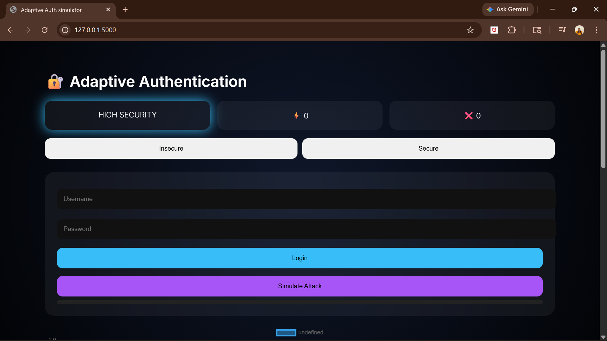
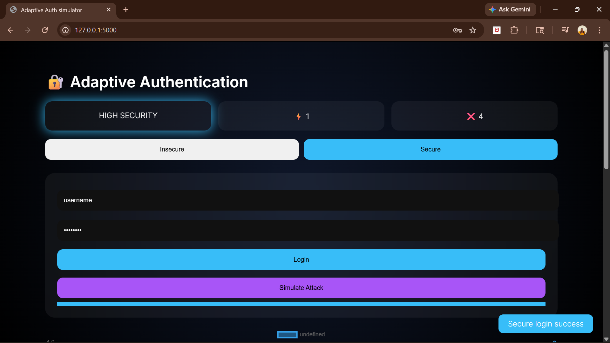
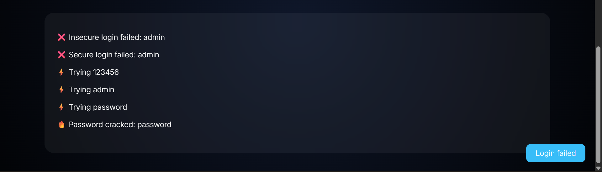
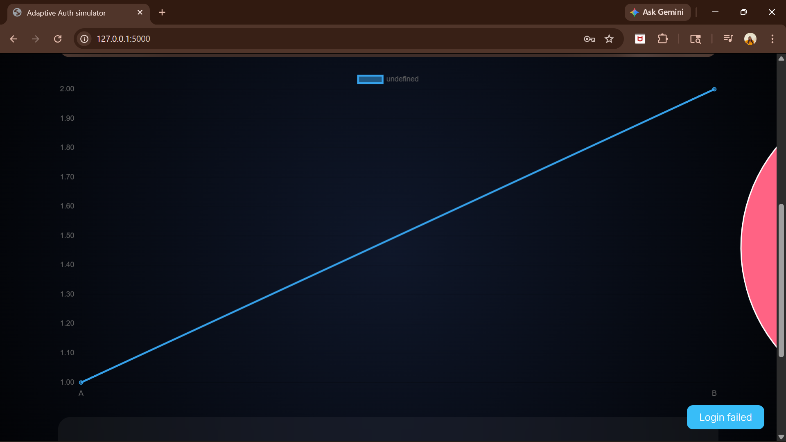

# Adaptive Authentication System

### Cyber Range-Based Attack & Defense Simulation

---

## 📌 Project Overview

The **Adaptive Authentication System** is a web-based cybersecurity simulation platform that demonstrates both **authentication attacks** and **defense mechanisms** in a controlled cyber range environment.

This project highlights how insecure systems can be exploited using password attacks and how modern security techniques such as **hashing, OTP, and account lock mechanisms** can mitigate these threats.

---

## 🎯 Key Objectives

* Simulate real-world password-based attacks
* Compare insecure vs secure authentication systems
* Implement multi-layer defense mechanisms
* Provide real-time monitoring and visualization

---

## ⚙️ Core Features

### 🔓 Insecure Authentication (Attack Target)

* Plain-text password verification
* Vulnerable to dictionary attacks
* Demonstrates weak security practices

---

### 🔐 Secure Authentication (Defense System)

* SHA-256 password hashing
* Account lock after multiple failed attempts
* OTP-based secondary authentication
* Prevents brute-force and unauthorized access

---

### 🧨 Attack Simulation Engine

* Dictionary-based password cracking
* Simulated attack progression
* Demonstrates how weak passwords are compromised

---

### 📊 Real-Time Dashboard

* Live logs of system activity
* Attack and failure statistics
* Interactive charts (line & doughnut)

---

### 🎨 User Interface

* Modern glassmorphism design
* Neon cyber-themed dashboard
* Animated components and transitions
* Interactive feedback system

---

## 🛠️ Technology Stack

| Component     | Technology            |
| ------------- | --------------------- |
| Backend       | Python (Flask)        |
| Frontend      | HTML, CSS, JavaScript |
| Visualization | Chart.js              |
| Security      | hashlib (SHA-256)     |

---

## 📂 Project Structure

```bash
Adaptive-Authentication-System/
├── app.py
├── requirements.txt
├── templates/
│   └── index.html
├── static/
│   └── style.css
├── images/
└── README.md
```

---

## 🚀 How to Run the Project

### 1. Install Dependencies

```bash
pip install flask
```

### 2. Run the Application

```bash
python app.py
```

### 3. Open in Browser

```bash
http://127.0.0.1:5000
```

---

## 👥 Default User Credentials (for testing)

| Username | Password    |
| -------- | ----------- |
| admin    | password123 |
| carol    | carol@123   |
| john     | john123     |
| alice    | alice@2026  |

---

## 📸 Screenshots

```markdown




```

---

## 🧠 Concepts Demonstrated

* Cyber Range Simulation
* Password Cracking (Dictionary Attack)
* Authentication Security
* Multi-Factor Authentication (MFA)
* Intrusion Detection (basic logging)

---

## 📈 Future Enhancements

* CAPTCHA integration
* Role-Based Access Control (RBAC)
* Database integration (SQLite/MySQL)
* Machine learning-based anomaly detection

---

## 👩‍💻 Author

Carolrebecca M

---

## 📜 License

This project is developed for academic and educational purposes only.
